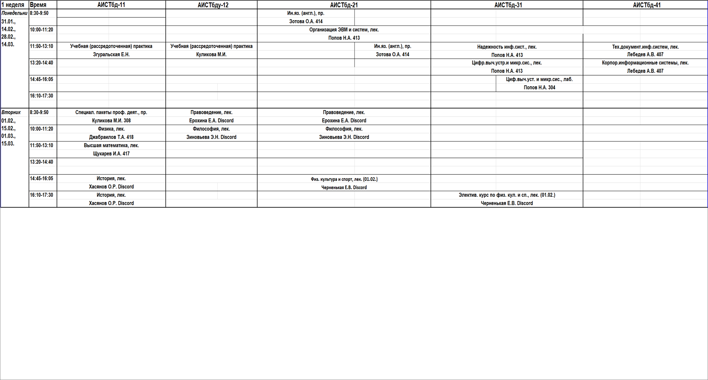
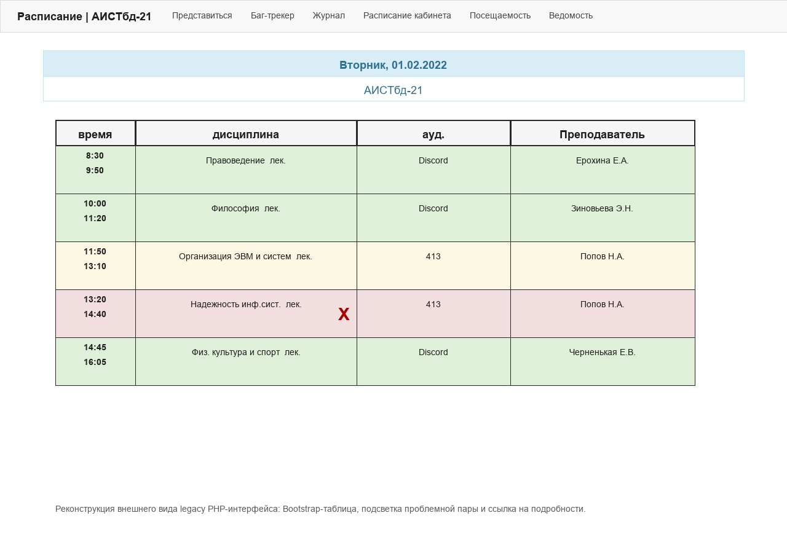
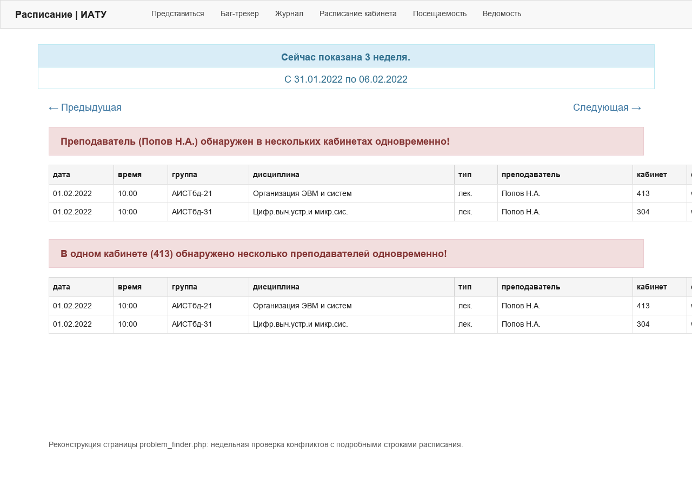
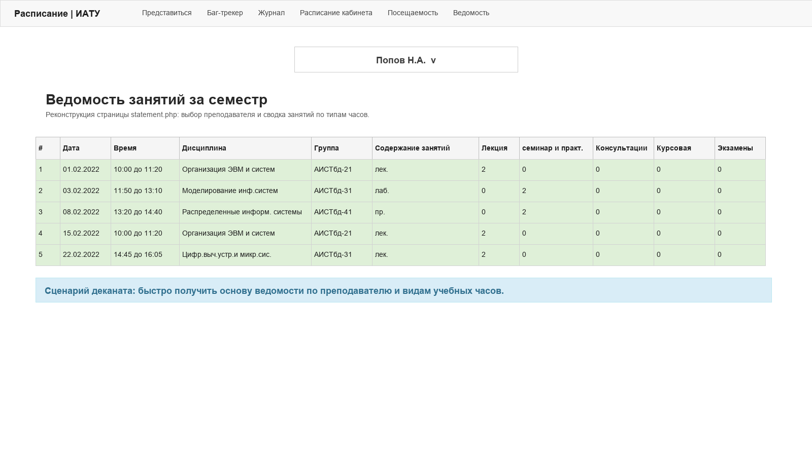
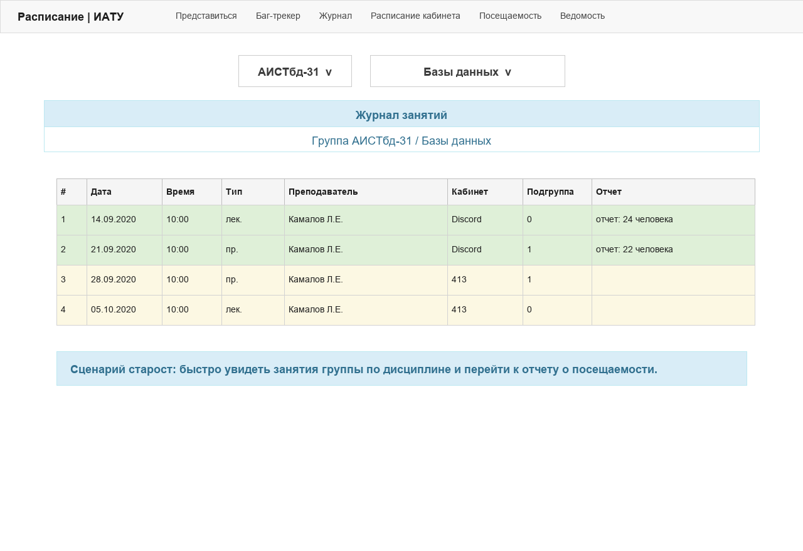
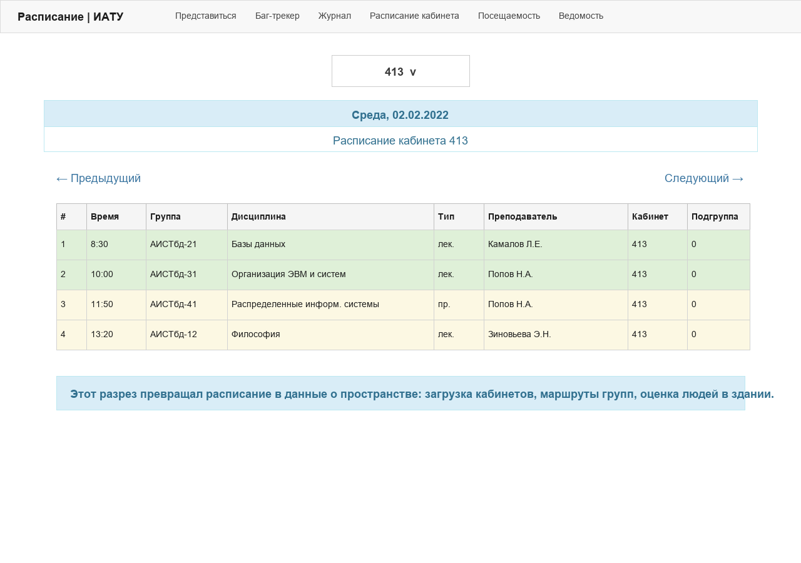

# IATU Schedule Legacy

Исторический снимок системы расписания ИАТУ/УлГТУ, которую я делал в 2017-2019 годах как самоучка.

До этой системы расписание фактически существовало в двух формах: бумажная таблица в институте и Excel-файл на сайте. Проект превратил этот процесс в работающую цифровую цепочку: Excel-парсер, нормализованная база данных, веб-интерфейс, экспорт и интеграции для мобильных клиентов.

> Это legacy-проект. Код сохранен как инженерная история и портфолио-кейс, а не как пример современной C# или PHP-архитектуры.

## Что внутри

- `legacy-parser/ConsoleParser` - C#-парсер Excel-файлов расписания.
- `legacy-parser/Tester` - тесты для ключевых эвристик парсинга.
- `legacy-web` - PHP-витрина для просмотра расписания студентами и преподавателями.
- `samples` - пример исходного Excel-файла, похожего на те, с которыми приходилось работать.
- `docs` - ретроспектива, описание алгоритма и разбор входного Excel-формата.

## Почему это было нетривиально

Исходный Excel не был таблицей данных. Это был визуальный документ для печати: объединенные ячейки, скрытые колонки, даты слева, пары в две строки, преподаватели и аудитории в одной строке, сокращения, подгруппы и исключения по датам.

Пример такого файла лежит здесь: [`samples/Informatsionnye_sistemy_i_tekhnologii.xls`](samples/Informatsionnye_sistemy_i_tekhnologii.xls).

## Как это выглядело

Фрагмент исходного Excel-файла, который нужно было превратить в структурированные данные:

Реконструкция веб-интерфейса расписания с подсветкой проблемной пары:

Реконструкция недельного баг-трекера конфликтов:

Реконструкция ведомости занятий для административной сводки по преподавателю и часам:

Реконструкция журнала занятий, которым могли пользоваться старосты:

Реконструкция расписания кабинета - разреза, который позже давал основу для аналитики использования пространства института:

## Куда смотреть в коде

- Основной batch-сценарий парсинга папок и отдельных файлов: [`legacy-parser/ConsoleParser/Program.cs`](legacy-parser/ConsoleParser/Program.cs#L35-L111).
- Загрузка справочников из MySQL для распознавания групп, аудиторий, типов занятий, дисциплин и преподавателей: [`Program.cs`](legacy-parser/ConsoleParser/Program.cs#L117-L197).
- Разбор содержимого одной ячейки расписания через "самое длинное совпадение" по словарю: [`Yacheyka.cs`](legacy-parser/ConsoleParser/Yacheyka.cs#L57-L123).
- Чтение структуры Excel для очного расписания: [`reader1.cs`](legacy-parser/ConsoleParser/reader1.cs#L13-L75).
- Запись результата в нормализованную MySQL-БД, дедупликация по MD5 и пометка старых файлов: [`WriterDB.cs`](legacy-parser/ConsoleParser/WriterDB.cs#L40-L96).
- Обработка обновлений расписания через "наслаивание" новых Excel-файлов поверх старых записей: [`Layering()`](legacy-parser/ConsoleParser/WriterDB.cs#L163-L200).
- Поиск конфликтов расписания и недельный "Баг-трекер": [`docs/CONFLICT_DETECTION.md`](docs/CONFLICT_DETECTION.md).
- Журнал занятий, которым пользовались старосты: [`docs/JOURNAL.md`](docs/JOURNAL.md).
- Ведомость занятий для деканата и учета часов преподавателей: [`docs/STATEMENT.md`](docs/STATEMENT.md).
- Расписание кабинета и аналитика использования пространства института: [`docs/CABINET_ANALYTICS.md`](docs/CABINET_ANALYTICS.md).
- Тестовые примеры распознавания ячеек, дат и времени: [`Tester/UnitTest1.cs`](legacy-parser/Tester/UnitTest1.cs#L12-L116).
- PHP-вывод расписания для группы: [`legacy-web/functions.php`](legacy-web/functions.php#L498-L536).
- Простая маршрутизация веб-интерфейса: [`legacy-web/index.php`](legacy-web/index.php#L73-L99).

## Что я бы сделал иначе сейчас

- Разделил бы парсер на явные этапы: геометрия Excel, логическая сетка, разбор содержимого ячейки, валидация, запись.
- Хранил бы конфигурацию и секреты вне репозитория.
- Убрал бы глобальное состояние и сделал зависимости явными.
- Добавил бы миграции БД и воспроизводимый dev setup.
- Отвязал бы unit-тесты от живой базы данных.
- В PHP-витрине использовал бы шаблоны, роутинг, prepared statements и экранирование HTML по контексту.

Подробнее: [`docs/RETROSPECTIVE.md`](docs/RETROSPECTIVE.md).

## Статус

Проект не поддерживается и не предназначен для запуска "из коробки". Некоторые зависимости старые, часть кода ориентирована на .NET Framework 4.5.2, MySQL и окружение 2017-2019 годов.

Ценность репозитория - в демонстрации реального внедрения, работы с грязными данными и эволюции инженерного мышления.
