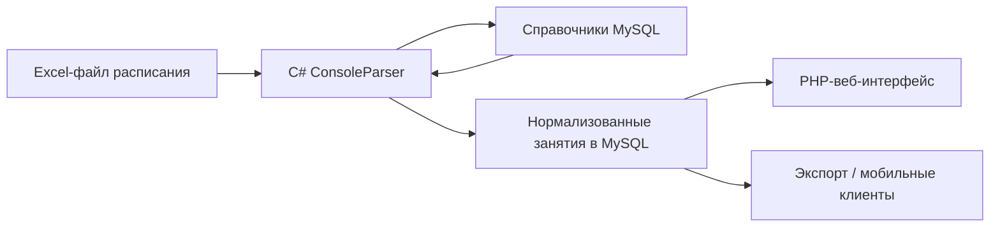

# Архитектура legacy-системы

Упрощенный поток данных:

## Parser

`ConsoleParser` принимал один файл через аргументы командной строки или проходил по рабочим папкам:

- `files/ochn` - очное расписание;
- `files/zaochn` - заочное расписание;
- `files/exam/ochn` - экзамены.

Для разных форматов использовались разные reader-классы: `reader1`, `reader2`, `reader3`.

## Справочники

Перед чтением файлов парсер загружал словарь из базы:

- группы;
- аудитории;
- виды занятий;
- дисциплины;
- преподаватели.

Этот словарь использовался для распознавания содержимого ячеек.

## Запись

`WriterDB` записывал результат в базу, проверял, был ли файл уже загружен, и отмечал старые версии расписания как неактуальные.

## Наслаивание расписания

Расписание часто обновлялось новым Excel-файлом, а не полной перегенерацией базы. Для этого в `WriterDB` была отдельная проверка `Layering()`: если в базе уже существовало актуальное занятие с той же датой, группой, временем начала и подгруппой, парсер считал новую запись обновлением.

Метод возвращал хеш старого файла, после чего `not_relevant()` помечал все записи этого файла как устаревшие. Так система могла принимать новые версии расписания без ручной очистки старых данных.

Смотреть: [`legacy-parser/ConsoleParser/WriterDB.cs`](../legacy-parser/ConsoleParser/WriterDB.cs#L163-L200).

## Web

PHP-витрина читала данные из MySQL и показывала расписание:

- для группы;
- для преподавателя;
- для кабинета;
- журнал занятий по группе и дисциплине;
- по неделе или одному дню;
- с проверками конфликтов аудиторий/преподавателей.

Проверки конфликтов были встроены в обычный вывод расписания и вынесены на отдельную страницу "Баг-трекер". Подробнее: [`CONFLICT_DETECTION.md`](CONFLICT_DETECTION.md).

Разрез по кабинетам позже можно было использовать не только как страницу расписания аудитории, но и как основу для небольшой аналитики пространства института: загрузки аудиторий, маршрутов групп и косвенной оценки нагрузки на здание. Подробнее: [`CABINET_ANALYTICS.md`](CABINET_ANALYTICS.md).

Во время COVID-19 поверх расписания появилась Discord-интеграция для удаленных занятий: пары с кабинетом `Discord` связывались с отчетами посещаемости по голосовым сессиям студентов. Подробнее: [`DISCORD_COVID.md`](DISCORD_COVID.md).
