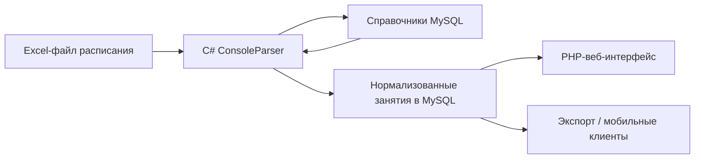

# Архитектура legacy-системы

Упрощенный поток данных:

## Parser

`ConsoleParser` принимал один файл через аргументы командной строки или проходил по рабочим папкам:

- `files/ochn` - очное расписание;
- `files/zaochn` - заочное расписание;
- `files/exam/ochn` - экзамены.

Для разных форматов использовались разные reader-классы: `reader1`, `reader2`, `reader3`.

## Справочники

Перед чтением файлов парсер загружал словарь из базы:

- группы;
- аудитории;
- виды занятий;
- дисциплины;
- преподаватели.

Этот словарь использовался для распознавания содержимого ячеек.

## Запись

`WriterDB` записывал результат в базу, проверял, был ли файл уже загружен, и отмечал старые версии расписания как неактуальные.

## Web

PHP-витрина читала данные из MySQL и показывала расписание:

- для группы;
- для преподавателя;
- по неделе или одному дню;
- с проверками конфликтов аудиторий/преподавателей.

